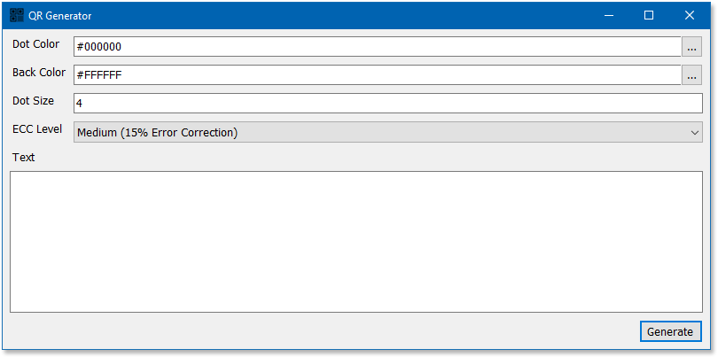
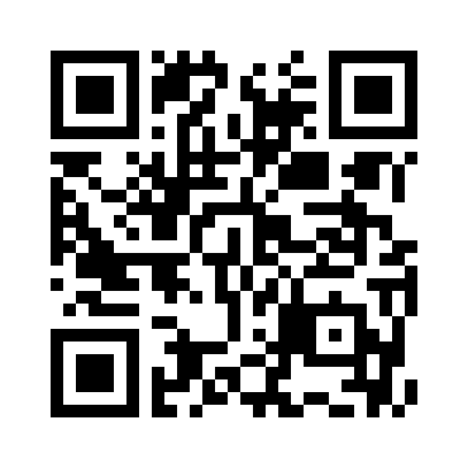
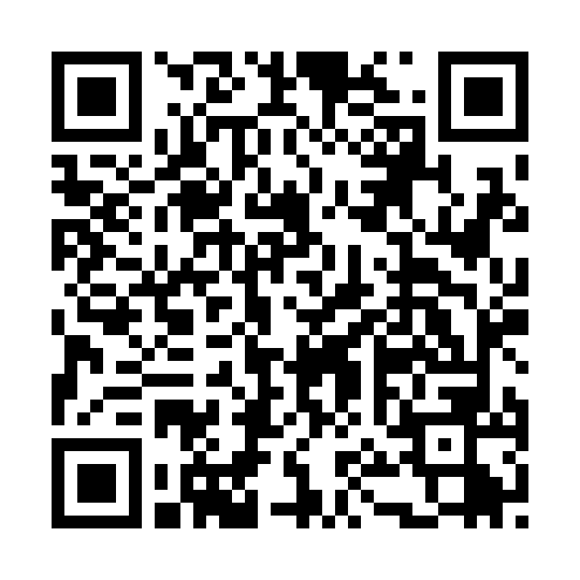
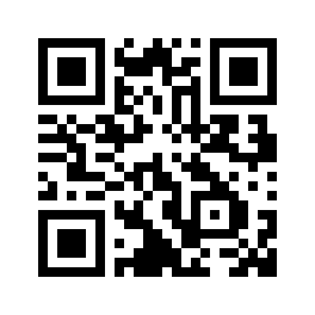
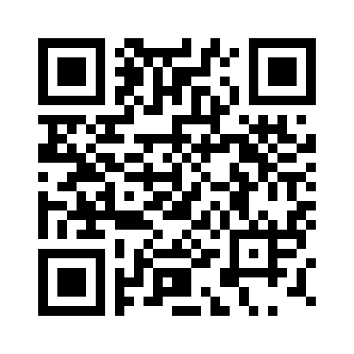
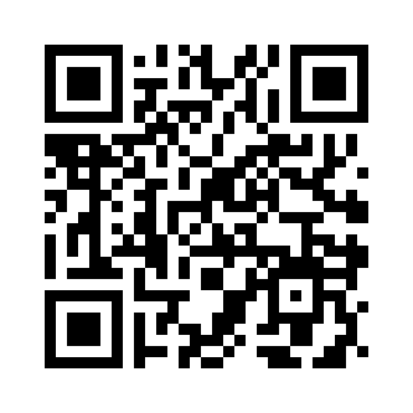
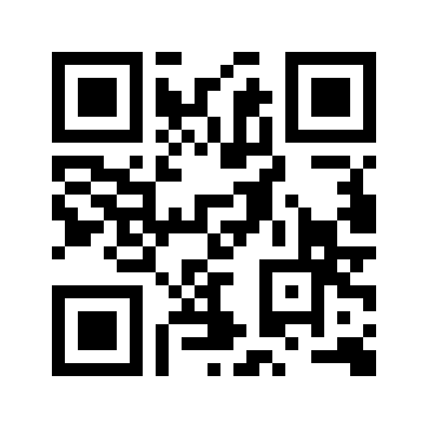
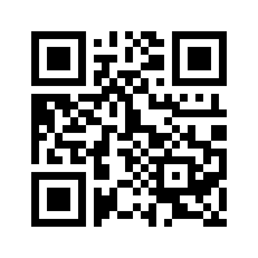

# QRGenerator
A tiny customizable QR generator for windows

This small application allows creating QR code in multiple colors and saves it as PNG file in same folder as program.

## Note:
- This application uses code from [CodeBude's QRCoder](https://github.com/codebude/QRCoder) however since their updates breaks ability of this application to run as standalone in all versions of windows without need to install 3rd party framework and libraries (.NET 6 runtime, ...), I had to use only part of their code from specific commit.
  
  In future I might remove dependency to their libraries completely.

- This application does not use online services and completely runs offline and should not ever try to connect to internet.
- This application stores last used settings in registry for later use, however if privacy is concerned, you can use included registry file to remove these settings.
- If you are using this QR for printing or embedding in websites, make sure it is not stretched otherwise most probably it cannot be scanned.

## How to use
- Simply download 0.1MB executable from releases (link on right side of this page) and run it.
- Set your colors for background and dot color (you can select the colors or enter a valid Web color)
- Select ECC Verification density (the larger the number, the bigger that QR will be but allows a damaged or partially covered QR still being scanned correctly.
- Enter your text and press Generate.
- Dot size allows creating larger dot sizes (note that dot size 1, probably will be too small to be scanned)
- Your QR will be stored in PNG file format in same folder as your application.

## Creating target specific QR
**Web address:** 

Start your text with `http://` or `https://`

Example: `https://github.com/BSarmady/QRGenerator/`

**Mail**

Use following format `mailto:{recipient email address}?subject={subject}&body={body}`

Example: `mailto:noreply@github.com?subject=why_u_no_reply&body=I sent you mane messages, why_u_no_reply`

**Call**

Add `tell:` in front of phone number

Example: `tel:+1 (877) 448-4820` (this is github's support phone number, don't bug them please!)

**SMS**

Use following format `sms:{recipient phone number}?body={body}`

Example: `mailto:+1 (877) 448-4820?body=a fancy message from me` (this is github's support phone number, don't bug them please!)

**WhatsApp**

use format `https://wa.me/{phone number}?text={your message}`

Example: `https://wa.me/18001234567?text=Hi+there`

**Skype**

Add `skype:` in front of username and to initiate call add `?call` at the back

Example: `skype:echo123?call`

**Location**

Add `geo:` in front of location `lat` and `lng` separated by comma (no space between)

Example: `geo:34.134054,-118.321502`

